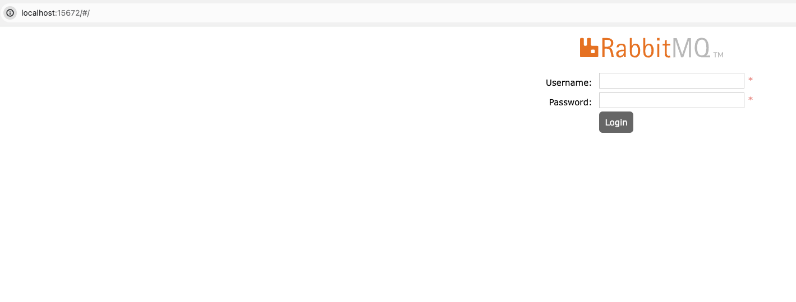

# Como iniciar

### Documentação de referência
Antes de iniciar o projeto será necessário instalar o Docker e o Docker Compose para que seja possível executar uma instância do RabbitMQ localmente pelo Docker.  Para saber mais sobre como instalar o Docker e o Docker compose, basta seguir os links a seguir:

* [Instalar o Docker](https://docs.docker.com/get-docker/)
* [Instalar o Docker Compose](https://docs.docker.com/compose/install/)

Um vez que o Docker e o Docker compose estiverem instalados no ambiente, será necessário abrir o terminal em seu computador (No Windows, o power shell, no Linux e no Mac, o terminal) e acessar a pasta do projeto.  Em seguida, executar o comando a seguir:

```console
docker-compose up -d
```

Se tudo der certo, para checar se o container do RabbitMQ está executando corretamente, basta executar o comando a seguir:

```console
docker container ls
```

E verá uma saída como esta a seguir:

```console
CONTAINER ID   IMAGE                       COMMAND                  CREATED       STATUS       PORTS                                                                                        NAMES
c09514bc812f   rabbitmq:3.8.6-management   "docker-entrypoint.s…"   2 hours ago   Up 2 hours   4369/tcp, 5671/tcp, 0.0.0.0:5672->5672/tcp, 15671/tcp, 25672/tcp, 0.0.0.0:15672->15672/tcp   rabbitmq-dev
```

Então, deve-se acessar o console do RabbitMQ para que se possa configurar as exchanges, filas e routing keys.  Basta acessar com o link a seguir:

* [Console local do RabbitMQ](http://localhost:15672/#/)

Véras algo como na imagem a seguir:



Para acessar o console, basta usar o user e senha padrões de quando criamos a instância do RabbitMQ via Docker compose:

user: guest

senha: guest

Por fim, precisamos criar as nossas exchanges, filas e routing keys.  Primeiro, acesse a aba queues para podermos criar as filas:

```
pagamento-request-queue
pagamento-response-sucesso-queue
pagamento-response-erro-queue
```

Em seguida, acesse a aba exchange e crie as seguintes exchanges:

```
pagamento-request-exchange
pagamento-response-sucesso-exchange
pagamento-response-erro-exchange
```

E por fim, vamos associar as nossas exchanges com as filas através das routing keys:

```
1) pagamento-request-exchange:
  pagamento-request-rout-key --> pagamento-request-queue

2) pagamento-response-sucesso-exchange
  pagamento-response-sucesso-rout-key --> pagamento-response-sucesso-queue

3) pagamento-response-erro-exchange
  pagamento-response-erro-rout-key --> pagamento-response-erro-queue
```

Configurações realizadas, é hora de inicializar o projeto, o que pode ser feito através de sua IDE preferida ou através do power shell (Windows) ou terminal (Linux ou MacOS), com o comando a seguir:

```console
./mvnw spring-boot:run
```

Para que seja possível realizar um teste e publicar um dado na fila pagamento-requisicao-queue, basta importar no insomnia a collection spring-boot-rabbitmq.json, localizada na pasta data do projeto e realizar a chamada POST para /pagamentos.  Ou simplesmente, se preferir, realizar uma chamada via power shell ou terminal, com o comando a seguir:

```console
curl --request POST \
  --url http://localhost:8080/pagamentos \
  --header 'Content-Type: application/json' \
  --data '{
	"numeroPedido": "1234",
	"valor": 20.00,
	"produto": "Teste"
}'
```

Lembrando que para executar a chamada acima, será preciso ter o curl instalado em seu ambiente.

Para que o dado seja consumido da fila, será necessário também executar o projeto a seguir em seu ambiente, seguindo as instruções do mesmo:

* [Worker de pagamentos](http://localhost:15672/#/)

Créditos totais e referência:

* [Tutorial Spring Boot e RabbitMQ](https://medium.com/@thiagolenz/tutorial-spring-boot-e-rabbitmq-como-fazer-e-porqu%C3%AA-4a6cc34a3bd1)
